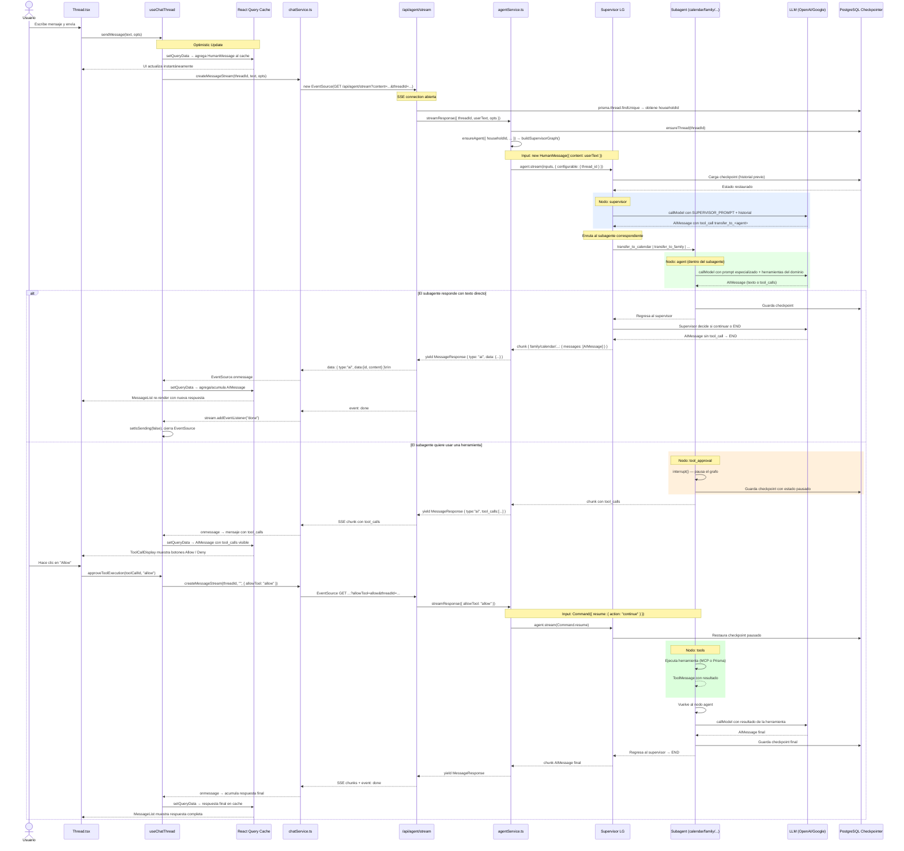

# Thread Flow — Arquitectura y flujo de datos

Este documento describe el flujo completo de una conversación en la aplicación, desde que el usuario escribe un mensaje hasta que recibe la respuesta del agente de IA.

---

## Visión general



---

## Capas del sistema

### 1. Contexto global — `ThreadContext`

**Archivo:** `src/contexts/ThreadContext.tsx`

Mantiene el `activeThreadId` como estado React global. Es un simple string que identifica qué conversación está activa en toda la aplicación.

```ts
const { activeThreadId, setActiveThreadId } = useThreadContext();
```

---

### 2. Componente `Thread` (UI)

**Archivo:** `src/components/Thread.tsx`

Punto de entrada visual para una conversación. Recibe `threadId` como prop y:

- Instancia el hook `useChatThread({ threadId })`
- Renderiza `MessageList` (historial) + `MessageInput` (entrada)
- Detecta el primer mensaje AI recibido para redirigir al thread (threads nuevos)

```tsx
const { messages, isLoadingHistory, isSending, sendMessage, approveToolExecution } = useChatThread({
  threadId,
});
```

---

### 3. Hook `useChatThread` — Orquestador principal

**Archivo:** `src/hooks/useChatThread.ts`

Es el núcleo del flujo de cliente. Gestiona tres responsabilidades:

#### A) Carga del historial

Usa **React Query** para obtener el historial de mensajes al montar:

```
React Query → fetchMessageHistory(threadId) → GET /api/agent/history/[threadId]
```

Los mensajes se cargan desde los checkpoints de LangGraph almacenados en Postgres.

#### B) `sendMessage(text, opts)`

1. Agrega el mensaje humano **optimistamente** al cache de React Query → UI instantánea
2. Delega a `handleStreamResponse` para abrir el stream SSE

#### C) `approveToolExecution(toolCallId, action)`

Maneja el flujo de aprobación de herramientas:

- Llama a `handleStreamResponse` con `opts.allowTool = "allow" | "deny"`
- No incluye texto nuevo (es una reanudación del grafo)

#### D) `handleStreamResponse` — Gestión del stream

- Abre un `EventSource` (SSE) hacia `/api/agent/stream`
- Escucha tres eventos:

| Evento      | Comportamiento                                       |
| ----------- | ---------------------------------------------------- |
| `onmessage` | Acumula chunks por `data.id` y actualiza React Query |
| `done`      | Limpia estado, cierra stream                         |
| `error`     | Inyecta mensaje de error en el cache                 |

**Acumulación de chunks:**

```
Primer chunk con nuevo id  → crea nueva entrada en la lista
Chunks siguientes          → concatena content al mensaje existente
```

---

### 4. `chatService` — Capa de comunicación HTTP

**Archivo:** `src/services/chatService.ts`

Abstrae las URLs y los parámetros de cada endpoint.

```ts
// Abre el stream SSE con todos los parámetros necesarios
createMessageStream(threadId, message, opts) → EventSource

// Historial
fetchMessageHistory(threadId) → MessageResponse[]

// CRUD de threads
fetchThreads() / createNewThread() / deleteThread(threadId)
```

Los parámetros enviados al stream:

| Param             | Descripción                                      |
| ----------------- | ------------------------------------------------ |
| `content`         | Texto del mensaje del usuario                    |
| `threadId`        | ID de la conversación                            |
| `model`           | Modelo LLM a usar (opcional)                     |
| `allowTool`       | `allow` o `deny` para aprobación de herramientas |
| `approveAllTools` | Saltar aprobación para todas las herramientas    |
| `attachments`     | JSON con archivos adjuntos                       |

El route también consulta `prisma.thread.householdId` y lo inyecta en los opts para que los subagentes de familia puedan cargar las herramientas correctas.

---

### 5. Route SSE — `/api/agent/stream`

**Archivo:** `src/app/api/agent/stream/route.ts`

Endpoint `GET` que devuelve un `ReadableStream` con headers SSE estándar:

```http
Content-Type: text/event-stream
Cache-Control: no-cache, no-transform
Connection: keep-alive
```

Flujo interno:

1. Parsea los query params
2. Llama a `agentService.streamResponse()`
3. Itera sobre los chunks, **solo reenvía** los de tipo `ai` o `tool`
4. Emite `event: done` al terminar o `event: error` si falla

---

### 6. `agentService.streamResponse` — Lógica del servidor

**Archivo:** `src/services/agentService.ts`

Prepara el input correcto para LangGraph según el contexto:

```
¿allowTool presente?
  → new Command({ resume: { action: "continue" | "deny" } })
    (reanuda el grafo pausado por interrupt())

¿Tiene attachments?
  → HumanMessage con array multimodal:
    [{ type: "text", text: userText }, ...contenidoArchivos]

¿Mensaje normal?
  → HumanMessage({ content: userText })
```

Luego ejecuta:

```ts
agent.stream(inputs, {
  streamMode: ["updates"],
  configurable: { thread_id: threadId },
});
```

El generador interno filtra los chunks y produce objetos `MessageResponse` limpios. Solo expone nodos de `VISIBLE_NODES`: `agent`, `calendar`, `general`, `family`, `reminder`, `recipe`, `shopping`.

---

### 7. LangGraph — Supervisor + Subagentes

**Archivos:** `src/lib/agent/supervisor.ts`, `src/lib/agent/subagents/`

La aplicación usa una arquitectura **Patrón B (Supervisor + Subagentes)**:

```
START → supervisor → transfer_to_<X> → <subagente> → supervisor → END
```

#### Supervisor

- Recibe el mensaje del usuario
- Su LLM está vinculado a 6 herramientas de transferencia: `transfer_to_calendar`, `transfer_to_general`, `transfer_to_family`, `transfer_to_reminder`, `transfer_to_recipe`, `transfer_to_shopping`
- Cada tool call devuelve un `Command({ goto: subagentName })`
- Si el LLM no llama ninguna herramienta → `END`

#### Subagentes

Cada subagente es un `AgentBuilder` compilado con su propio conjunto de herramientas:

| Subagente  | Herramientas                                  |
| ---------- | --------------------------------------------- |
| `calendar` | MCP tools con prefijo `google-calendar`       |
| `general`  | Todos los MCP tools excepto calendar          |
| `family`   | Prisma: contexto hogar, integrantes, despensa |
| `reminder` | Prisma: CRUD de recordatorios                 |
| `recipe`   | Prisma: guardar y buscar recetas              |
| `shopping` | Prisma: listas de compras                     |

#### Nodos de cada subagente

| Nodo                | Responsabilidad                                                  |
| ------------------- | ---------------------------------------------------------------- |
| `agent`             | Llama al LLM con el historial completo de mensajes               |
| `shouldApproveTool` | Router: ¿hay tool_calls? → `tool_approval`, si no → `END`        |
| `tool_approval`     | Pausa con `interrupt()` o pasa directo si `approveAllTools=true` |
| `tools`             | Ejecuta la herramienta y agrega el resultado como `ToolMessage`  |

#### Checkpointer de Postgres

El estado del grafo se persiste en cada paso. Esto permite:

- Reanudar conversaciones previas
- El patrón `interrupt()` / `Command.resume()` para aprobación de herramientas
- Historial de mensajes consistente entre sesiones

---

## Flujo de aprobación de herramientas

Este es el flujo más complejo del sistema (human-in-the-loop):

```
1. LLM decide usar una herramienta
       ↓
2. agent → tool_approval node
       ↓
3. interrupt() pausa el grafo y persiste estado en Postgres
       ↓
4. Servidor emite chunk AI con tool_calls (pero sin respuesta final)
       ↓
5. Frontend detecta tool_calls → muestra botones Allow / Deny
       ↓
6. Usuario hace clic → approveToolExecution("allow" | "deny")
       ↓
7. handleStreamResponse con opts.allowTool
       ↓
8. agentService crea: new Command({ resume: { action: "continue" | "update" } })
       ↓
9. LangGraph reanuda el grafo desde el checkpoint guardado
       ↓
10. "allow" → tools node → ejecuta herramienta → regresa a agent
    "deny"  → el tool call se cancela
```

---

## Tipos de mensajes

**Archivo:** `src/types/message.ts`

| Tipo    | Descripción                                            |
| ------- | ------------------------------------------------------ |
| `human` | Mensaje del usuario                                    |
| `ai`    | Respuesta del LLM (puede incluir `tool_calls`)         |
| `tool`  | Resultado de la ejecución de una herramienta           |
| `error` | Error generado por el frontend para mostrar al usuario |

---

## Almacenamiento

| Dato                            | Almacenamiento                           |
| ------------------------------- | ---------------------------------------- |
| Metadata de threads             | Postgres (via Prisma, tabla `Thread`)    |
| householdId del thread          | Postgres (campo `Thread.householdId`)    |
| Historial de mensajes           | Postgres (LangGraph checkpointer)        |
| Configuración de MCP servers    | Postgres (via Prisma, tabla `MCPServer`) |
| Datos del hogar familiar        | Postgres (Household, FamilyMember, …)    |
| Recetas, compras, recordatorios | Postgres (modelos Family Copilot)        |
| Archivos adjuntos               | MinIO / S3-compatible                    |
